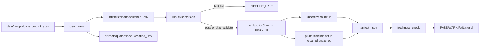

# Kiến trúc Pipeline - Lab Day 10

## 1. Mục tiêu kiến trúc
- Đảm bảo dữ liệu policy sạch trước khi vào retrieval (Day 08/09).
- Có điểm chặn chất lượng rõ ràng trước khi publish vector.
- Có log và manifest để truy vết theo `run_id`.

## 2. Luồng end-to-end

## 3. Component responsibilities
| Component | Input | Output | Trách nhiệm |
|---|---|---|---|
| Ingest (`etl_pipeline.py`) | raw CSV | list rows | đọc dữ liệu đầu vào, log `raw_records` |
| Transform (`transform/cleaning_rules.py`) | raw rows | cleaned + quarantine | chuẩn hóa date, dedupe, rule fix/refuse |
| Quality (`quality/expectations.py`) | cleaned rows | expectation results + halt flag | chặn publish khi lỗi severity `halt` |
| Embed (`etl_pipeline.py::cmd_embed_internal`) | cleaned CSV | Chroma collection `day10_kb` | `upsert` theo `chunk_id`, `prune` stale ids |
| Monitoring (`monitoring/freshness_check.py`) | manifest | PASS/WARN/FAIL + detail | tính age theo `latest_exported_at` và SLA |

## 4. Publish boundary
- Dữ liệu chính thức để phục vụ retrieval là `cleaned_<run_id>.csv` + Chroma snapshot sau `upsert/prune`.
- Quarantine chỉ là vùng cách ly, không được dùng để embed.

## 5. Idempotency và rerun
- Key idempotent: `chunk_id`.
- Rerun cùng dữ liệu sạch không làm tăng số vector trùng.
- Nếu dữ liệu sạch thay đổi, pipeline sẽ:
  - cập nhật vector theo id mới,
  - xóa id cũ không còn trong snapshot (`embed_prune_removed`).

## 6. Observability points
- Log runtime: `artifacts/logs/run_<run_id>.log`.
- Manifest: `artifacts/manifests/manifest_<run_id>.json`.
- Quarantine evidence: `artifacts/quarantine/quarantine_<run_id>.csv`.
- Retrieval evidence: `artifacts/eval/*.csv`, `artifacts/eval/grading_run.jsonl`.

## 7. Tích hợp Day 09
- Day 09 retrieval worker đọc từ cùng Chroma DB/path theo config.
- Vì vậy Day 10 pipeline là lớp kiểm soát chất lượng trước khi supervisor/worker trả lời user.
- Nguyên tắc: debug theo thứ tự `data -> quality -> retrieval -> generation`.

## 8. Known risks
- Freshness có thể FAIL khi dữ liệu mẫu cố ý cũ (`latest_exported_at` cũ hơn SLA).
- Nếu mở `--skip-validate`, có rủi ro đưa dữ liệu bẩn vào index (chỉ dùng cho inject demo).
- Artifact CSV có thể bị lock bởi Excel, làm command ghi đè thất bại.
